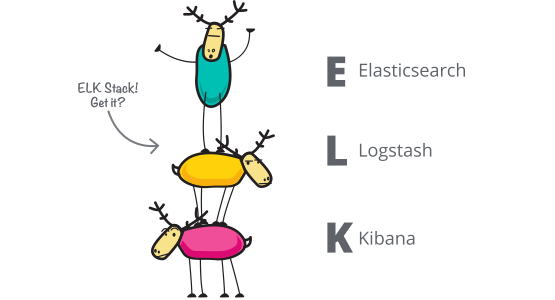
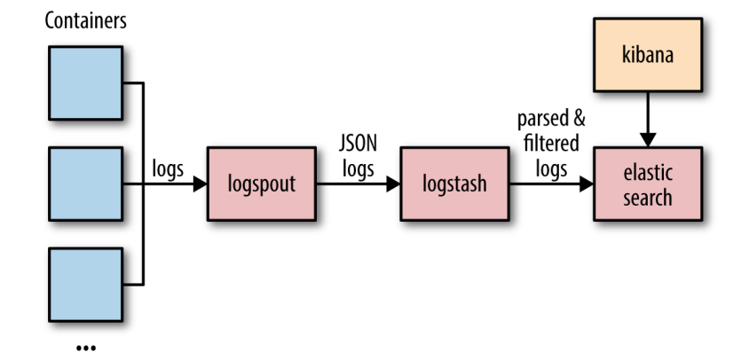

# Installation

## Développement

### Système hôte (CentOS)


Machine virtuelle CentOS 1708 afin de se rapprocher de l'environnement d'OpenShift (RHEL/Atomic)

Installation d'une image `.iso`:
+ Allocation mémoire 8 Go
+ Mode Headless de la VM
+ SSH 
+ Création de l'utilisateur `corentin:corentin`

### Docker


```bash
$ curl -fsSL get.docker.com -o get-docker.sh
$ sudo sh get-docker.sh
```

Ajouter l'utilisateur courant dans le groupe Unix Docker pour éviter de lancer Docker et ses dépendances avec `sudo`: 
```bash
$ sudo usermod -aG docker corentin
```

Ajouter Docker au lancement du système:
```bash
$ sudo systemctl enable docker
```

#### Problème fréquent

`cannot connect to the docker daemon at unix ///var/run/docker.sock. is the docker daemon running`

Cette erreur indique que le démon n'arrive pas à se connecter au socket, redémarrons-le :
```bash
$ sudo service docker stop
$ systemctl start docker
```


### ELK


> Ne pas confondre ELK (ou Elk...) avec le frère du cerf, le Wapiti qui correspond à sa traduction française... d'où les cervidés ci-dessus.

ELK signifie ElasticSearch, Logstash et Kibana. Il s’agit de coupler les 3 logiciels pour obtenir une solution d’analyse de log performante et complète. Les outils sont:

+ **ElasticSearch** : moteur de stockage et d’indexation de documents et moteur de requête/d’analyse de ceux-ci
+ **Logstash** : analyse, filtrage et découpage des logs pour les transformer en documents, parfaitement formatés notamment pour ElasticSearch
+ **Kibana** : dashboard interactif et paramétrable permettant de visualiser les données stockées dans ElasticSearch

Ces outils libres sont développés par la même structure, la société Elastic, qui encadre le développement communautaire et propose des services complémentaires (support, formation, intégration et hébergement cloud).

L'architecture générale d'ELK peut se schématiser comme suit:



## Intégration/Production

### OpenShift


> En cours...